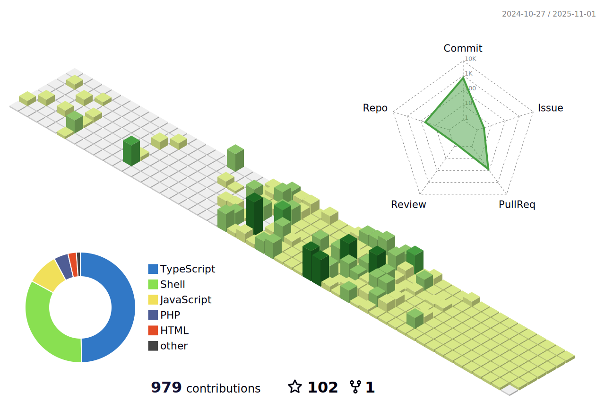

<!--   my-ticker -->    
[+üëã,+I+am+Ubong+Sunday;+Welcome+to+My+Profile!;Over+4+years+of+programming+experience;Always+learning+new+things+;Software+Development+enthusiast+;Kaggle+community+member)](https://git.io/typing-svg)

###


###

<!--   my-icons -->
<fieldset>
  <p align="center"> ✨ <i>Tech Stack Highlights...</i> ✨ </p>
</fieldset>
<p align="center">
    <a href="https://github.com/Certsoftt/certsoftt"></a>
    <a href="https://github.com/facebook/create-react-app"></a>
    <a href="https://github.com/Certsoftt/certsoftt/graphs/contributors"></a>
    <a href="https://github.com/Certsoftt/certsoftt/stargazers"></a>
    <a href="https://github.com/Certsoftt/certsoftt/network/members"></a>
       
</p>

<!--   my-header-img -->

<a href="https://en.wikipedia.org/wiki/Brendan_Eich"></a>

# 💫 About Me:
I have competency with ReactJS and Laravel. </br>
Currently learning C++ (👨🏻‍💻🎯)

# 📊 GitHub Stats:
<br/>

<br/>


## 🏆 GitHub Trophies


###

<!-- dark snake -->


<!--   profile-green-animate -->



 <!--   my-skils -->

| Property                                        | Data                                                                                                                                                                                                                                                                                                                                                                                                                                                                                                                                                                                                                                                                                                                                                                                                                                                                                                                                                                                                                                                                                                                                                                                                                                                                                                                                                                                                                                                                                                                                                                                                                                                                                                                                                                                                                                                                                                                                                                  |
|-------------------------------------------------|-----------------------------------------------------------------------------------------------------------------------------------------------------------------------------------------------------------------------------------------------------------------------------------------------------------------------------------------------------------------------------------------------------------------------------------------------------------------------------------------------------------------------------------------------------------------------------------------------------------------------------------------------------------------------------------------------------------------------------------------------------------------------------------------------------------------------------------------------------------------------------------------------------------------------------------------------------------------------------------------------------------------------------------------------------------------------------------------------------------------------------------------------------------------------------------------------------------------------------------------------------------------------------------------------------------------------------------------------------------------------------------------------------------------------------------------------------------------------------------------------------------------------------------------------------------------------------------------------------------------------------------------------------------------------------------------------------------------------------------------------------------------------------------------------------------------------------------------------------------------------------------------------------------------------------------------------------------------------|
| **Language / IDE**                              |     &nbsp; &nbsp; &nbsp; &nbsp;                                                                                                                                                                                                                                                                                                                                                                                                                                                                                                                                                                                                                                                                                                                                                                                                                                                                                                                                                                                                                                                                                                                                                                                                                                                                                                    |
| **Domain Knownledge**                           | [](https://github.com/Certsoftt/certsoftt) [](https://github.com/search?q=user%3ACertsoftt&type=Repositories) [](https://github.com/search?q=user%3ACertsoftt&type=Repositories) [](https://github.com/search?q=user%3ACertsoftt&type=Repositories)                                                                                                                                                                                                                                                                                                                                                                                                                                                                                                                                                                                                                                                                                                                                                                                                                                                                                                                                                                                                                                                                                                                                                                                                                                            |
| **CI / CD**                                     | [](https://github.com/Certsoftt/certsoftt) &nbsp; &nbsp; [](https://code.visualstudio.com)|
| **Databases**                                   | &nbsp; &nbsp; [](https://www.postgresql.org)&nbsp;                                                                                                                                                                                                                                                                                                                                                                                                                                                                                                                                                                                                                                                                                                                                                                                                                                                                                                                                                                                                                                                                                                                                                                                                                                                                                                                                                                                                                                                                                                                                                                                                                                                                                                                                                                                                |
| **Automation/ Cloud Technologies** |     &nbsp; |
  


<!--   GitHub stats graph -->
### 📈 GitHub Activity Graph:

<!--   green snake -->

<!--   stats + languages -->


<!-- dark snake -->


<!--   profile-green-animate -->


**📫 How to Reach me:**
<p align="left">
<a href="https://linkedin.com/in/ubong-ukpe" target="blank"></a>
<a href="mailto:ukpeubong8573@gmail.com" target="blank"></a>
<a href="https://api.whatsapp.com/send?phone=+2348148106698" alt="Connect on Whatsapp">  </a>
</p>


 <!--software-development-->

   
 


<div align="center">
<summary>Trophy: Hackerrank Profile Trophy</summary>
</div>

<p align="center"> 

 

</p>


<!-- Uyo - My Home-->
  
 ```geojson
{
 "type": "FeatureCollection",
 "features": [
   {
     "type": "Feature",
     "id": 1,
     "properties": {
       "ID": 0
     },
     "geometry": {
       "type": "Polygon",
       "coordinates": [
         [
             [379,109.95],
             [557,072.27]
         ]
       ]
     }
   }
 ]
}

```


#### Thanks for visiting :heart:

<p align="center"> 
  

### Profile Views
counting of visitors to this page in this section started from June 12, 2022


</br>

[MIT](LICENSE)


</p>

---
  *If you liked my profile, you can Star ⭐ the repo and if you want to use this template you can Fork it and can use.* 
---
Would you like to meet me?

If you want to contribute to any of my repositories, feel free to submit PRs, issues and email me. 
Pick a slot if you'd like to meet me and chat about proposals and ideas - but make sure to describe the agenda

---
  *I use an automatic subscription control system. Thus, everyone who subscribes to me, I will subscribe to those and I will respond, and vice versa, I will remove all those who unsubscribe from me from among those who should be followed.* 
---


